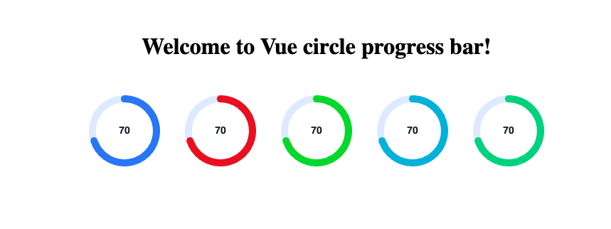

# Welcome to CircleProgress!

## CircleProgress - A Circular Progress Bar Component for Vue 3

Elevate your Vue 3 applications with **CircleProgress**, a beautifully designed and highly customizable circular progress bar component. Built with Echart for maximum performance and responsiveness, CircleProgress offers a sleek and modern way to visualize progress in any project.

Whether you're building dashboards, progress indicators, or any visual representation of data, CircleProgress gives you the flexibility to tailor every aspect to fit your design needs. With its lightweight architecture, you can effortlessly integrate it into your Vue applications without sacrificing performance.

## Key Features:

*   **Customizable Styles**: Adjust colors, sizes, and animations to match your app's theme effortlessly.
    
*   **Lightweight & Efficient**: Designed to be resource-friendly while providing a stunning visual experience.
    
*   **Responsive Design**: Perfectly scales to fit any screen size, ensuring a consistent look across devices.
    
*   **Easy Integration**: Simple to implement and configure, making it a breeze to add to your projects.
    

Unlock the potential of your user interfaces with CircleProgress and make your applications not just functional, but visually captivating!

## Installation

```
npm install --save vue-gauge-circle
```
## Adding into app

```
import { CircleProgress } from 'vue-circle-progress';

<CircleProgress 
    :progressValue="70"
    :minValue="0" 
    :maxValue="100" 
    :viewport="100"
    :fontSize="14" 
    :fontLineHeight="19"
    :lineWidth="10"
    :fontColor="'rgba(15, 31, 60, 1)'"
    :offsetColor="'rgba(227, 237, 255, 1)'"
    :progresColor="'rgba(66, 131, 252, 1)'"
/>
```

## Props

The `CircleProgress` component allows you to customize the progress bar using the following props:

| Prop Name         | Type     | Description                               | Default                  |
|-------------------|----------|-------------------------------------------|--------------------------|
| `progressValue*`  | `Number` | Current value of the progress bar.       | - (required)             |
| `minValue*`       | `Number` | Minimum value for the progress bar.      | `0`                      |
| `maxValue*`       | `Number` | Maximum value for the progress bar.      | `100`                    |
| `fontSize`        | `Number` | Font size of the progress text.          | `22`                     |
| `fontLineHeight`  | `Number` | Line height for the progress text.       | `29`                     |
| `fontColor`       | `String` | Color of the progress text.               | `rgba(15, 31, 60, 1)`   |
| `offsetColor`     | `String` | Color of the background circle.          | `rgba(227, 237, 255, 1)` |
| `progresColor`    | `String` | Color of the progress indicator.         | `rgba(66, 131, 252, 1)`  |
| `lineWidth`       | `Number` | Width of the progress line.              | `15`                     |
| `viewport`        | `Number` | Size of the circular progress bar.       | `100`                    |

